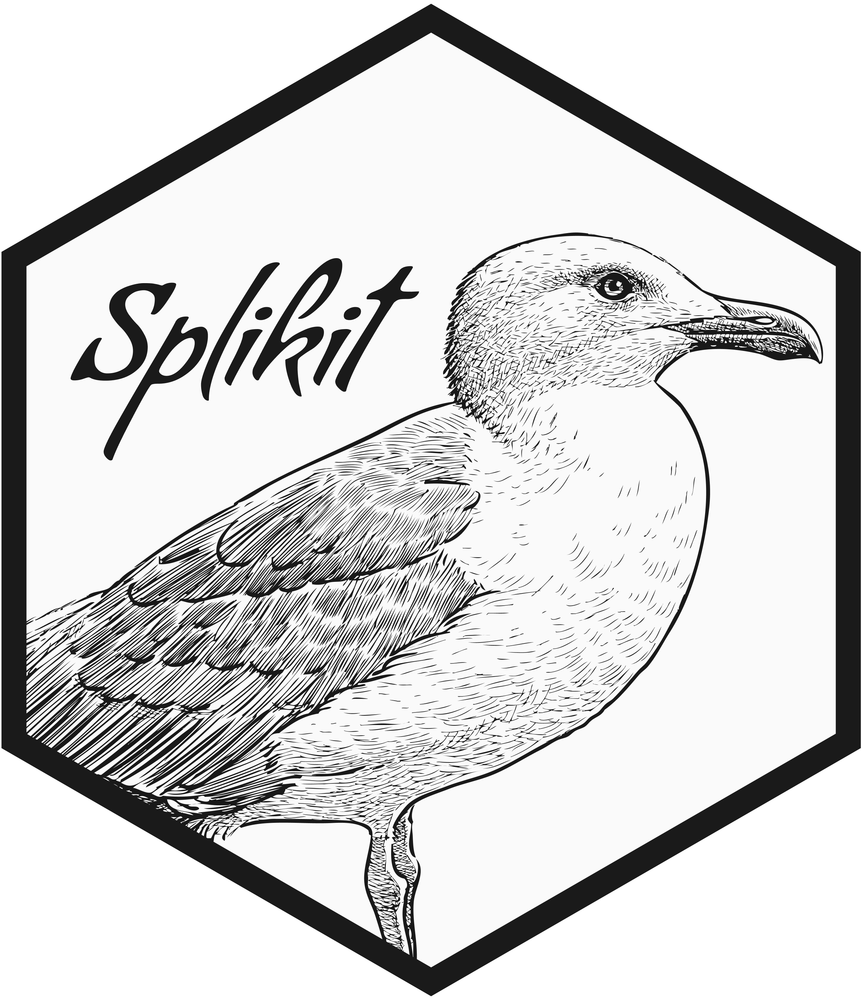

**Splikit** /ˈsplaɪ.kɪt/ is a comprehensive R toolkit for analyzing alternative splicing in single-cell RNA sequencing (scRNA-seq) data. It offers a streamlined workflow for transforming raw junction abundance data from tools such as STARsolo into actionable insights—detecting differential splicing events and enabling rich downstream analyses. Designed for both power and ease of use, Splikit integrates high-performance C++ implementations and memory-efficient data structures to handle large datasets, all through a clean and intuitive R interface.

[](https://github.com/csglab/splikit/actions/workflows/R-CMD-check.yml)
[](https://csglab.github.io/splikit/)

## **Requirements**

-   [R version 4.1.0](https://www.R-project.org/) or later.
-   R libraries: [Rcpp](https://CRAN.R-project.org/package=Rcpp), [RcppArmadillo](https://CRAN.R-project.org/package=RcppArmadillo), [Matrix](https://CRAN.R-project.org/package=Matrix), [data.table](https://CRAN.R-project.org/package=data.table), [R6](https://CRAN.R-project.org/package=R6)


## Installation

To install the latest version of `splikit` from GitHub:

```r
# Install devtools if you haven't already
install.packages("devtools")

# Install splikit
devtools::install_github("csglab/splikit")
```
## Usage

Splikit provides two ways to work with your data: a modern **R6 class interface** (recommended) and **traditional functions** (for backward compatibility).

### R6 Class Interface (Recommended)

The `SplikitObject` class provides a clean, chainable interface with built-in validation:

```r
library(splikit)

# Load data and create SplikitObject
junction_ab <- load_toy_SJ_object()
obj <- splikit(junction_ab = junction_ab, min_counts = 1)

# Compute M2 exclusion matrix (uses fast C++ implementation)
obj$makeM2(n_threads = 4)

# Find highly variable splicing events
HVE <- obj$findVariableEvents(min_row_sum = 50, n_threads = 4)

# View object summary
obj$summary()

# Access data directly
m1_matrix <- obj$m1
m2_matrix <- obj$m2
event_data <- obj$eventData
```

### Traditional Function Interface

The original function-based approach remains fully supported:

```r
# Create m1 matrix from a junction abundance object
junction_abundance_object <- load_toy_SJ_object()
m1_object <- make_m1(
  junction_abundance_object,
  min_counts = 1,
  verbose = FALSE
)

# Create m2 matrix from the m1 inclusion matrix
m2_matrix <- make_m2(
  m1_inclusion_matrix = m1_object$m1_inclusion_matrix,
  eventdata = m1_object$eventdata,
  n_threads = 4  # Uses C++ with OpenMP
)

# Perform feature selection for splicing events
m1_matrix <- m1_object$m1_inclusion_matrix
HVE_Info <- find_variable_events(m1_matrix, m2_matrix, n_threads = 32)
```

### Key Features

- **High-performance C++ backend**: Core computations use RcppArmadillo with OpenMP parallelization
- **Memory-efficient sparse matrices**: Handles large single-cell datasets
- **Comprehensive validation**: Input checking with informative error messages
- **Flexible API**: Choose between R6 methods or traditional functions


## Documentation

Full guides, examples, and tutorials are available at the [Splikit webpage](https://csglab.github.io/splikit/)

## License

This project is licensed under the MIT License – see the `LICENSE.md` file for details.

## Acknowledgment

The author is aware of the package’s limitations and potential breakpoints. It was developed under limited knowledge, time, and resources, and is provided with the hope that it will be useful. Feedback and contributions from the community are warmly welcomed. If you encounter any issues or have suggestions, please [open an issue](https://github.com/csglab/splikit/issues/new).


