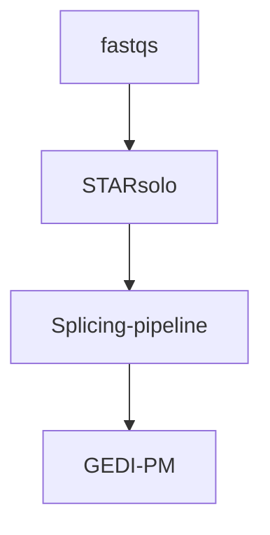

# Splicing-Pipeline

**1. Mapping using STARsolo**
-
We used [STAR](https://github.com/alexdobin/STAR/tree/master) as the primary mapper for this pipeline. For this step you will need R1 and R2 fastq files as well as the GTF file and the index built using STAR. The raw fastq files have been procced with STARsolo using `--soloFeatures SJ` to get the counts for annotated and novel splice junctions. The output of shold be present in the `SJ.out.tab` file. The outputh should be like this:
```
chr1    3109059 3226649 1       1       0       0       4       43
chr1    3122081 3133046 1       1       0       1       0       15
chr1    3145384 3146420 2       2       0       3       0       42
chr1    3220998 3226168 2       2       0       0       1       22
chr1    3271768 3271922 0       0       0       3       0       45
chr1    3277541 3283661 2       2       1       6       0       40
chr1    3281209 3283661 2       2       0       5       0       43
chr1    3287192 3491924 2       2       1       2       0       23
```

The columns have the following meaning:
```
column 1: chromosome
column 2: first base of the intron (1-based)
column 3: last base of the intron (1-based)
column 4: strand (0: undefined, 1: +, 2: -)
column 5: intron motif: 0: non-canonical; 1: GT/AG, 2: CT/AC, 3: GC/AG, 4: CT/GC, 5: AT/AC, 6: GT/AT
column 6: 0: unannotated, 1: annotated in the splice junctions database. Note that in 2-pass mode, junctions detected in the 1st pass are reported as annotated, in addition to annotated junctions from GTF.
column 7: number of uniquely mapping reads crossing the junction
column 8: number of multi-mapping reads crossing the junction
column 9: maximum spliced alignment overhang
```

We are useing the raw tab file for the junction abundace and will apply ad-hoc filtartion troughout the pipeline. For more information about how to build genome index and mapping using STAR please take a look at examples codes.


Here's a simple flowchart




**2. Grouping the junction abundance**
--

We grouped splice junctions according to the coordinates of their intronic regions into “local junction variants” (LJVs). An LJV is defined as a set of junctions that share either the first or the last coordinate.

For each junction within an LJV, we extracted the junction abundance count for every cell, which we refer to as the **M1 count**. The **M2 count** for a given junction in each cell is defined as the sum of the counts of its alternative junctions—that is, all other junctions within the same LJV. In other words, for each junction and cell, the number of reads supporting that junction is contrasted with the total number of reads supporting its alternative junctions. For example, if $( M1_{ij} )$ represents the count for junction $j$ in cell $i$, then the M2 count can be written as:


```math
M2_{ij} = \sum_{\substack{k \in J \\ k \neq j}} M1_{ik}
```


where $J$ denotes the set of all junctions in the LJV. Such clarity is essential to correctly communicate the intended computation.

The grouping method is determined by whether the first or the last coordinate is used, with an appended `-E` or `-S` added to the event IDs accordingly. This approach may result in a single junction receiving two different measurements in the M2 counts (in the inclusion matrix) while having identical measurements in the M1 matrix.

We also handle sample-specific junctions. If a junction is present in only a subset of samples, a corresponding vector of zeros is applied to the M1 matrix for the samples in which the junction is absent, and the M2 measurements are computed accordingly. This figure shows a perfect examples of two different LJVs.

.jpg?raw=true)


Subsequently, we employed a Poisson read splitting (thinning) technique to divide the raw counts into train and test data sets to address the double-dipping problem (wherein the same data set is used to generate and test a hypothesis). This was followed by a filtration of highly variable features in both modalities. 


# Usage

The first step of the pipeline is to make a list of junction abundance and event data **per sample**. `eventdata` has reports for each junction and has the same number of rows as M1 and M2 matricies contaies the chromosome number, start and end coordinates as well as other quality and grouping metrics. This step could be done using `multigedi_make_junction_ab`.
### 1. `multigedi_make_junction_ab`

**Example:**

```r
SJ_object <- multigedi_make_junction_ab(STARsolo_SJ_dirs= c("./example_star_solo_outout/Solo.out/SJ/"),
                                        sample_ids=c("SMP_1"),
                                        use_internal_whitelist = TRUE)
```

**Arguments:**


- `STARsolo_SJ_dirs`   A character vector or list of strings representing the paths to STARsolo SJ directories. Each directory should contain the raw splicing junction output files.
sample_ids

- `sample_ids`   A character vector or list of unique sample IDs corresponding to each directory in `STARsolo_SJ_dirs`.(It will attached to the barcodes in the final matrices).

- `use_internal_whitelist`   A logical flag (default `TRUE`) indicating whether to use the internal STARsolo whitelist located at `../Gene/filtered/barcodes.tsv` for each sample when `white_barcode_lists` is `NULL`.

- `white_barcode_lists`   A list of character vectors, each containing barcode whitelist(s) for the corresponding sample. If `NULL` (default), the function uses the internal STARsolo whitelist if `use_internal_whitelist` is `TRUE`.


After getting the object with sample specefic junction abundance matrices and related event data you need to use `multigedi_make_m1` to get all in one M1 and eventdata.

### 2. `multigedi_make_m1`

**Example:**

```r
m1_obj <- multigedi_make_m1(junction_ab_object= SJ_object)

# # the out puth should be a list with two objects, one is M1 matrix and the other one should be eventdata
# summary(m1_obj)
# 
# >                     Length Class      Mode
# > m1_inclusion_matrix 663320 dgCMatrix  S4  
# > event_data              13 data.table list
```

**Arguments:**
- `junction_ab_object`   A named list that function `multigedi_make_junction_ab` returns where each element represents a sample's junction abundance data. Each element must contain eventdata` and a sparse matrix

After obtaining M1 and the event data, you must generate an exclusion matrix, M2. If you intend to perform a count split, ensure that this operation is done prior to creating M2. This order is crucial because it guarantees that the resulting `m1_test` and `m1_train` subsets remain statistically independent. In this context, you should use the `multigedi_countsplit` function, which is essentially an integrated version of the main function from the [countsplit R package](https://github.com/anna-neufeld/countsplit/blob/develop/R/countsplit.R).

### 3. `multigedi_countsplit`

**Example:**

```r
m1 <- m1_obj$m1_inclusion_matrix
multigedi_countsplit(m1_inclusion_matrix= m1,
                    folds = 2,
                    epsilon  = c(0.5, 0.5),
                    object_names = "m1")

```
**Arguments:**

- `m1_inclusion_matrix`   A dense or sparse  numerical matrix to be split.
- `folds`   A positive numeric value specifying the number of folds. Default is 2.
- `epsilon`   A numeric vector of length 2 specifying the epsilon values. Default is \code{c(0.5, 0.5)}.
- `object_names`   A character string specifying the base name for output train/test objects. The deafult is "m1".

```
m2_test <- multigedi_make_m2(m1_inclusion_matrix= m1_test, eventdata=m1_obj$event_data)
m2_train <- multigedi_make_m2(m1_inclusion_matrix= m1_train, eventdata=m1_obj$event_data)

```


```
velocyto_obj <- multigedi_make_velo(velocyto_dirs=c("./example_star_solo_outout/Solo.out/Velocyto/"), sample_ids=c("SMP_1"))
summary(velocyto_obj)
```


```

multigedi_countsplit(m1_inclusion_matrix= velocyto_obj$spliced, object_names="spliced")
multigedi_countsplit(m1_inclusion_matrix= velocyto_obj$unspliced, object_names="unsplicezd")


```

