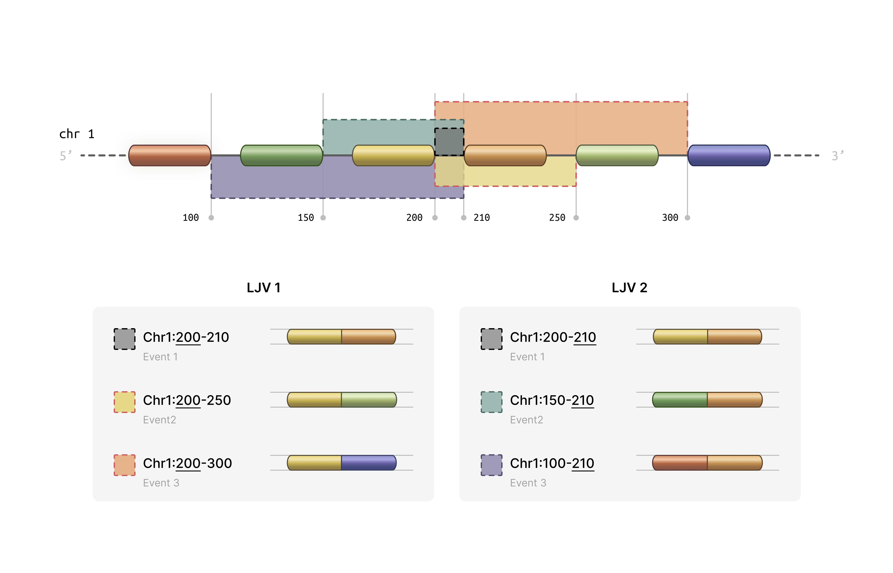

# Splikit Manual for Single-Cell Splicing Analysis

## Table of Contents

1. [Introduction](#introduction)
2. [Installation](#installation)
3. [Core Concepts](#core-concepts)
4. [Getting Started](#getting-started)
5. [R6 Object-Oriented Interface](#r6-object-oriented-interface)
6. [Main Workflow Functions](#main-workflow-functions)
7. [Feature Selection Functions](#feature-selection-functions)
8. [Utility Functions](#utility-functions)
9. [Complete Workflow Example](#complete-workflow-example)
10. [Advanced Usage](#advanced-usage)
11. [Troubleshooting](#troubleshooting)
12. [Function Reference](#function-reference)

---

## Introduction

**Splikit** is a comprehensive R package designed for analyzing alternative splicing events in single-cell RNA sequencing data. Developed by the Computational and Statistical Genomics Laboratory at McGill University, splikit provides a complete toolkit for processing STARsolo splicing junction output, identifying highly variable splicing events, and performing downstream analyses.

### What Does Splikit Do?

Splikit transforms raw splicing junction data into meaningful biological insights through several key capabilities:

- **Junction Data Processing**: Converts STARsolo splicing junction output into structured matrices suitable for analysis
- **Inclusion/Exclusion Matrix Generation**: Creates M1 (inclusion) and M2 (exclusion) matrices that capture splicing behavior across cells
- **Variable Event Detection**: Identifies highly variable splicing events using advanced statistical methods
- **Gene Expression Integration**: Processes standard gene expression data alongside splicing information
- **Statistical Analysis**: Provides tools for correlation analysis, variance computation, and clustering evaluation
### How splikit get these data?
We grouped splice junctions according to the coordinates of their intronic regions into “local junction variants” (LJVs). An LJV is defined as a set of junctions that share either the first or the last coordinate.

For each junction within an LJV, we extracted the junction abundance count for every cell, which we refer to as the **M1 count**. The **M2 count** for a given junction in each cell is defined as the sum of the counts of its alternative junctions—that is, all other junctions within the same LJV. In other words, for each junction and cell, the number of reads supporting that junction is contrasted with the total number of reads supporting its alternative junctions. For example, if $( M1_{ij} )$ represents the count for junction $j$ in cell $i$, then the M2 count can be written as:

``` math
M2_{ij} = \sum_{\substack{k \in J \\ k \neq j}} M1_{ik}
```

where $J$ denotes the set of all junctions in the LJV. The grouping method is determined by whether the first or the last coordinate is used, with an appended `-E` or `-S` added to the event IDs accordingly. This approach may result in a single junction receiving two different measurements in the M2 counts (in the exclusion matrix) while having identical measurements in the M1 matrix (inclusion matrix).

We also address sample-specific junctions. If a junction is present in only a subset of samples, a vector of zeros is assigned to the M1 matrix for the samples where the junction is absent. The M2 measurements are then computed accordingly. This figure illustrates two exemplary LJVs.



Traditional single-cell RNA-seq analysis focuses primarily on gene expression levels, but alternative splicing represents an additional layer of cellular complexity. Splikit enables researchers to:

1. **Capture Splicing Diversity**: Identify cell-type-specific splicing patterns that might be missed by gene expression alone
2. **Integrate Multiple Modalities**: Combine splicing and expression data for comprehensive cellular characterization
3. **Scale Efficiently**: Handle large single-cell datasets with optimized C++ implementations
4. **Ensure Reproducibility**: Follow standardized workflows with well-documented functions

---

## Installation

### Prerequisites

Splikit requires several dependencies that are automatically installed:

```r
# Core dependencies (installed automatically)
required_packages <- c("Rcpp", "RcppEigen", "RcppArmadillo", "Matrix", "data.table")
```

### Installation from Source

```r
# Install from GitHub (replace with actual repository)
devtools::install_github("csglab/splikit")

# Load the package
library(splikit)
```

### Verify Installation

```r
# Load example data to test functionality
toy_data <- load_toy_SJ_object()
print(names(toy_data))
```

---

## Core Concepts

Understanding splikit requires familiarity with several key concepts in splicing analysis:

### Splicing Junction Events

A splicing junction represents the connection between two exons after intron removal. In single-cell data, we observe:

- **Inclusion Events**: When a particular exon or junction is included in the mature transcript
- **Exclusion Events**: When a particular exon or junction is skipped during splicing

### Matrix Representations

Splikit uses two primary matrix types:

**M1 Matrix (Inclusion Matrix)**:
- Rows represent splicing events
- Columns represent individual cells
- Values indicate the number of reads supporting inclusion of each event

**M2 Matrix (Exclusion Matrix)**:
- Same dimensions as M1
- Values indicate the number of reads supporting exclusion of each event
- Calculated based on the total splicing activity at shared coordinate groups

### Coordinate Groups

Splikit groups splicing junctions that share start or end coordinates, enabling the calculation of exclusion events. This grouping is essential because:

- Multiple junctions can share the same donor (5') or acceptor (3') site
- The total splicing activity at these sites helps quantify exclusion events
- Groups with only one member cannot generate exclusion events

### Variable Event Detection

The package identifies highly variable splicing events using statistical methods:

- **Deviance-based Approach**: Models splicing ratios using beta-binomial or similar distributions
- **Variance Stabilization**: Applies transformations to identify events with genuine biological variability
- **Library-wise Calculation**: Accounts for technical variation between samples or libraries

---

## Getting Started

Let's begin with a simple example using the provided toy dataset:

```r
library(splikit)

# Load the toy splicing junction data
toy_sj_data <- load_toy_SJ_object()

# Examine the structure
str(toy_sj_data, max.level = 2)

# The toy data contains junction abundance information for multiple samples
# Each sample has 'eventdata' (metadata) and 'junction_ab' (sparse matrix)
```

### Quick Start Workflow

Here's the minimal workflow to get from raw data to variable events:

```r
# Step 1: Create M1 matrix
m1_result <- make_m1(toy_sj_data)
m1_matrix <- m1_result$m1_inclusion_matrix
event_data <- m1_result$event_data

# Step 2: Create M2 matrix
m2_matrix <- make_m2(m1_matrix, event_data)

# Step 3: Find highly variable events
variable_events <- find_variable_events(m1_matrix, m2_matrix)

# View top variable events
head(variable_events[order(-sum_deviance)])
```

---

## R6 Object-Oriented Interface

Starting with version 2.0.0, splikit introduces a modern R6 object-oriented interface through the `SplikitObject` class. This provides a more intuitive and streamlined workflow with method chaining support.

### Creating a SplikitObject

```r
library(splikit)

# Load toy data for demonstration
toy_sj_data <- load_toy_SJ_object()

# Create SplikitObject from junction abundance data
spl <- SplikitObject$new(junction_ab_object = toy_sj_data)

# View object summary
print(spl)
```

### Complete Workflow with Method Chaining

The R6 interface supports method chaining for a clean, pipeline-style workflow:

```r
# Complete analysis pipeline with method chaining
spl <- SplikitObject$new(junction_ab_object = toy_sj_data)$
  makeM1(min_counts = 1)$
  makeM2(n_threads = 4, verbose = TRUE)$
  findVariableEvents(min_row_sum = 30, n_threads = 4)

# Access results
m1_matrix <- spl$m1
m2_matrix <- spl$m2
variable_events <- spl$variableEvents
event_data <- spl$eventData
```

### Step-by-Step Workflow

For more control, you can call methods individually:

```r
# Create object
spl <- SplikitObject$new(junction_ab_object = toy_sj_data)

# Step 1: Create M1 matrix
spl$makeM1(min_counts = 1, verbose = TRUE)
print(dim(spl$m1))  # Check dimensions

# Step 2: Create M2 matrix with multi-threading
spl$makeM2(
  n_threads = 4,           # Number of OpenMP threads
  use_cpp = TRUE,          # Use optimized C++ implementation
  verbose = TRUE
)
print(dim(spl$m2))  # Same dimensions as M1

# Step 3: Find highly variable events
spl$findVariableEvents(
  min_row_sum = 30,
  n_threads = 4
)

# View top variable events
top_events <- spl$variableEvents[order(-sum_deviance)][1:10]
print(top_events)
```

### Subsetting SplikitObjects

SplikitObjects support flexible subsetting by events, cells, or both:

```r
# Subset by events (rows)
top_100_events <- spl$variableEvents$events[1:100]
spl_subset <- spl$subset(events = top_100_events)

# Subset by cells (columns)
selected_cells <- colnames(spl$m1)[1:500]
spl_cells <- spl$subset(cells = selected_cells)

# Subset both events and cells
spl_combined <- spl$subset(
  events = top_100_events,
  cells = selected_cells
)

# Check dimensions
print(dim(spl_subset$m1))
print(dim(spl_cells$m1))
print(dim(spl_combined$m1))
```

### Working with Existing Matrices

You can also create a SplikitObject from pre-computed matrices:

```r
# Load pre-computed M1/M2 data
toy_m1m2 <- load_toy_M1_M2_object()

# Create SplikitObject from existing matrices
spl <- SplikitObject$new(
  m1_matrix = toy_m1m2$m1,
  m2_matrix = toy_m1m2$m2
)

# Directly find variable events (M1 and M2 already computed)
spl$findVariableEvents(min_row_sum = 50, n_threads = 4)
```

### Accessing SplikitObject Fields

The SplikitObject provides access to all data through fields:

```r
# Core matrices
spl$m1              # Inclusion matrix (events × cells)
spl$m2              # Exclusion matrix (events × cells)

# Metadata
spl$eventData       # Event metadata data.table
spl$variableEvents  # Variable events results

# Original data
spl$junctionAbObject  # Raw junction abundance data
```

### R6 vs Function-Based Interface Comparison

Both interfaces produce identical results. Choose based on your workflow preference:

**R6 Interface** (recommended for new users):
```r
spl <- SplikitObject$new(junction_ab_object = toy_sj_data)$
  makeM1(min_counts = 1)$
  makeM2(n_threads = 4)$
  findVariableEvents(min_row_sum = 30)

m1 <- spl$m1
m2 <- spl$m2
hve <- spl$variableEvents
```

**Function-Based Interface** (traditional):
```r
m1_result <- make_m1(toy_sj_data, min_counts = 1)
m2 <- make_m2(m1_result$m1_inclusion_matrix, m1_result$event_data, n_threads = 4)
hve <- find_variable_events(m1_result$m1_inclusion_matrix, m2, min_row_sum = 30)
```

### Performance Features

The SplikitObject methods support the same performance optimizations as the underlying functions:

- **Multi-threading**: Set `n_threads` parameter for OpenMP parallelization
- **Memory-efficient M2**: Version 2.0.0 includes a completely rewritten `make_m2` implementation with ~30x memory reduction
- **C++ optimization**: Set `use_cpp = TRUE` (default) for maximum performance

```r
# Check if OpenMP is available
check_openmp_enabled()

# Use all available cores for large datasets
n_cores <- parallel::detectCores() - 1

spl$makeM2(n_threads = n_cores, use_cpp = TRUE, verbose = TRUE)
spl$findVariableEvents(n_threads = n_cores, min_row_sum = 50)
```

---

## Main Workflow Functions

### `make_junction_ab()`

**Purpose**: Processes STARsolo splicing junction output into structured R objects.

**Function Signature**:
```r
make_junction_ab(STARsolo_SJ_dirs, white_barcode_lists = NULL, 
                 sample_ids, use_internal_whitelist = TRUE, 
                 verbose = FALSE, keep_multi_mapped_junctions = FALSE, ...)
```

**Parameters**:

- `STARsolo_SJ_dirs`: Character vector of paths to STARsolo SJ directories
- `white_barcode_lists`: Optional list of barcode whitelists for filtering
- `sample_ids`: Unique identifiers for each sample
- `use_internal_whitelist`: Whether to use STARsolo's internal filtered barcodes (default TRUE)
- `verbose`: Logical for detailed progress reporting (default FALSE)
- `keep_multi_mapped_junctions`: Whether to keep multi-mapped junctions (default FALSE)
- `...`: Additional parameters for future extensions

**Expected Directory Structure**:
```
STARsolo_output/
├── SJ/
│   ├── raw/
│   │   ├── matrix.mtx      # Junction count matrix
│   │   ├── barcodes.tsv    # Cell barcodes
│   │   └── features.tsv    # Junction features
│   └── filtered/
│       └── barcodes.tsv    # Filtered barcodes
└── SJ.out.tab              # STAR junction output
```

**Returns**: 
A named list where each element corresponds to a sample and contains:
- `eventdata`: Data.table with junction metadata (chromosome, coordinates, strand)
- `junction_ab`: Sparse matrix of junction abundances (junctions × cells)

**Example**:
```r
# Single sample processing
sj_dirs <- "/path/to/STARsolo/output/SJ"
sample_names <- "Sample1"

junction_data <- make_junction_ab(
  STARsolo_SJ_dirs = sj_dirs,
  sample_ids = sample_names,
  use_internal_whitelist = TRUE
)

# Multiple samples with custom barcodes
sj_dirs <- c("/path/to/sample1/SJ", "/path/to/sample2/SJ")
sample_names <- c("Control", "Treatment")
custom_barcodes <- list(
  c("AAACCTGAGCATCGCA", "AAACCTGAGCGAACGC"),  # Control barcodes
  c("AAACCTGAGGAATGGT", "AAACCTGAGGGCTCTC")   # Treatment barcodes
)

junction_data <- make_junction_ab(
  STARsolo_SJ_dirs = sj_dirs,
  white_barcode_lists = custom_barcodes,
  sample_ids = sample_names,
  use_internal_whitelist = FALSE
)
```

**Understanding the Output**:

The `eventdata` component contains crucial information for each junction:
- `chr`, `start`, `end`, `strand`: Genomic coordinates
- `start_cor_id`, `end_cor_id`: Coordinate identifiers for grouping
- `row_names_mtx`: Unique junction identifiers
- `sample_id`: Sample origin

### `make_m1()`

**Purpose**: Transforms junction abundance data into the inclusion matrix (M1) with coordinate-based grouping.

**Function Signature**:
```r
make_m1(junction_ab_object, min_counts = 1, verbose = FALSE)
```

**Parameters**:
- `junction_ab_object`: Output from `make_junction_ab()`
- `min_counts`: Minimum count threshold for filtering events (default 1)
- `verbose`: Logical for detailed progress reporting (default FALSE)

**The Coordinate Grouping Process**:

This function performs sophisticated grouping of junctions that share coordinates:

1. **Start Coordinate Grouping**: Junctions sharing the same 5' splice site are grouped
2. **End Coordinate Grouping**: Junctions sharing the same 3' splice site are grouped
3. **Matrix Expansion**: Each group generates new rows in the M1 matrix
4. **Event Naming**: Groups are labeled with "_S" (start) or "_E" (end) suffixes

**Returns**:
- `m1_inclusion_matrix`: Sparse matrix with expanded events based on coordinate groups
- `event_data`: Enhanced metadata with group information

**Example**:
```r
# Process junction data into M1 matrix
m1_result <- make_m1(junction_data)

# Examine the structure
print(dim(m1_result$m1_inclusion_matrix))  # Events × Cells
print(nrow(m1_result$event_data))          # Number of events

# Check the grouping information
table(m1_result$event_data$group_count)    # Distribution of group sizes
```

**Understanding M1 Structure**:

The M1 matrix represents inclusion evidence:
- Each row corresponds to a specific splicing event (possibly grouped)
- Each column corresponds to a single cell
- Values represent the number of reads supporting inclusion of that event
- Events with "_S" suffix represent start coordinate groups
- Events with "_E" suffix represent end coordinate groups

### `make_m2()`

**Purpose**: Creates the exclusion matrix (M2) from the M1 matrix and event data with intelligent memory management.

**Function Signature**:
```r
make_m2(m1_inclusion_matrix, eventdata, batch_size = 5000,
        memory_threshold = 2e9, force_fast = FALSE,
        multi_thread = FALSE, n_threads = 1, use_cpp = TRUE,
        verbose = FALSE)
```

**Parameters**:
- `m1_inclusion_matrix`: Output from `make_m1()`
- `eventdata`: Event metadata from `make_m1()`
- `batch_size`: Number of groups to process per batch when using batched mode (default 5000)
- `memory_threshold`: Maximum rows before switching to batched processing (default 2e9)
- `force_fast`: Force fast processing regardless of memory estimates (default FALSE)
- `multi_thread`: Enable parallel processing for batched operations (default FALSE)
- `n_threads`: Number of OpenMP threads for C++ implementation (default 1)
- `use_cpp`: Use optimized C++ implementation (default TRUE, recommended)
- `verbose`: Logical for detailed progress reporting (default FALSE)

**Performance Notes (v2.0.0)**:
The C++ implementation has been completely rewritten for version 2.0.0 with significant improvements:
- **~8x faster execution** through two-pass CSC format construction
- **~30x lower memory usage** by eliminating intermediate dense matrices
- Memory usage now scales with output size only: O(nnz_output) + O(n_groups)
- Previous versions used O(n_groups × n_cells) for intermediate storage

**The Exclusion Calculation Logic**:

For each coordinate group, M2 values are calculated as:
```
M2[event, cell] = Total_Group_Activity[group, cell] - M1[event, cell]
```

This means:
1. For each coordinate group, sum all inclusion reads across group members
2. For each individual event, subtract its inclusion reads from the group total
3. The remainder represents "exclusion" evidence for that specific event

**Example**:
```r
# Create M2 matrix
m2_matrix <- make_m2(m1_result$m1_inclusion_matrix, m1_result$event_data)

# Compare dimensions
print(dim(m1_result$m1_inclusion_matrix))
print(dim(m2_matrix))  # Should be identical

# Examine the relationship between M1 and M2
cor_values <- diag(cor(as.matrix(m1_result$m1_inclusion_matrix[1:100, 1:50]), 
                      as.matrix(m2_matrix[1:100, 1:50])))
summary(cor_values)  # Often negative correlation
```

**Interpreting M2 Values**:

- High M2 values indicate strong evidence for exclusion of that specific event
- M2 values of zero occur when an event represents all activity in its coordinate group
- The M1/M2 ratio provides information about splicing ratios

### Additional Data Processing Functions

#### `make_gene_count()`

**Purpose**: Processes standard gene expression matrices alongside splicing data.

```r
gene_expression <- make_gene_count(
  expression_dirs = "/path/to/10X/output",
  sample_ids = "Sample1",
  use_internal_whitelist = TRUE
)
```

#### `make_velo_count()`

**Purpose**: Processes spliced/unspliced matrices for RNA velocity analysis.

```r
velocity_data <- make_velo_count(
  velocyto_dirs = "/path/to/velocyto/output",
  sample_ids = "Sample1",
  merge_counts = TRUE  # Combine spliced/unspliced across samples
)
```

---

## Feature Selection Functions

### `find_variable_events()`

**Purpose**: Identifies highly variable splicing events using deviance-based statistics.

**Function Signature**:
```r
find_variable_events(m1_matrix, m2_matrix, min_row_sum = 50, 
                     n_threads = 1, verbose = TRUE, ...)
```

**Parameters**:
- `m1_matrix`, `m2_matrix`: Inclusion and exclusion matrices
- `min_row_sum`: Minimum total reads per event for inclusion in analysis
- `n_threads`: Number of threads for parallel processing (requires OpenMP)
- `verbose`: Whether to print progress messages

**The Statistical Method**:

The function calculates deviance statistics for each event:

1. **Library-wise Processing**: Analyzes each sample/library separately
2. **Ratio Modeling**: Models the M1/(M1+M2) ratio for each event
3. **Deviance Calculation**: Computes how much each event deviates from expected behavior
4. **Summation**: Combines deviance scores across all libraries

**Returns**:
A data.table with columns:
- `events`: Event identifiers
- `sum_deviance`: Combined deviance score across all libraries

**Example**:
```r
# Load toy data
toy_data <- load_toy_M1_M2_object()
m1_matrix <- toy_data$m1
m2_matrix <- toy_data$m2

# Find variable events with different parameters
hve_default <- find_variable_events(m1_matrix, m2_matrix)
hve_strict <- find_variable_events(m1_matrix, m2_matrix, min_row_sum = 100)

# Compare results
print(nrow(hve_default))  # Number of events analyzed
print(nrow(hve_strict))   # Fewer events with stricter filter

# Top variable events
top_events <- hve_default[order(-sum_deviance)][1:20]
print(top_events)
```

**Interpreting Results**:

- Higher `sum_deviance` values indicate more variable splicing behavior
- Events with high variability might represent:
  - Cell-type-specific splicing patterns
  - Response to environmental conditions
  - Technical artifacts (require validation)

### `find_variable_genes()`

**Purpose**: Identifies highly variable genes using either variance stabilization or deviance methods.

**Function Signature**:
```r
find_variable_genes(gene_expression_matrix, method = "vst", 
                   n_threads = 1, verbose = TRUE, ...)
```

**Parameters**:
- `gene_expression_matrix`: Sparse gene expression matrix
- `method`: Either "vst" (variance stabilizing transformation) or "sum_deviance"
- `n_threads`: Number of threads for parallel processing (only for sum_deviance method)
- `verbose`: Logical for progress reporting (default TRUE)

**Method Comparison**:

**VST Method (Default)**:
- Implements Seurat-style variance stabilization
- Faster computation through C++ implementation
- Good for identifying highly expressed variable genes

**Sum Deviance Method**:
- Similar to the splicing event approach
- Models gene expression using negative binomial deviances
- Better for lowly expressed genes

**Example**:
```r
# Using toy gene expression data
toy_data <- load_toy_M1_M2_object()
gene_expr <- toy_data$gene_expression

# VST method (faster)
hvg_vst <- find_variable_genes(gene_expr, method = "vst")
print(head(hvg_vst[order(-standardize_variance)]))

# Deviance method (more comprehensive)
hvg_dev <- find_variable_genes(gene_expr, method = "sum_deviance")
print(head(hvg_dev[order(-sum_deviance)]))

# Compare methods
length(intersect(hvg_vst[1:500]$events, hvg_dev[1:500]$events))
```

---

## Utility Functions

### `get_pseudo_correlation()`

**Purpose**: Computes pseudo-R² correlation between external data and splicing behavior using beta-binomial modeling.

**Function Signature**:
```r
get_pseudo_correlation(ZDB_matrix, m1_inclusion, m2_exclusion, 
                      metric = "CoxSnell", suppress_warnings = TRUE)
```

**Parameters**:
- `ZDB_matrix`: External data matrix (e.g., gene expression, protein levels) - must be dense
- `m1_inclusion`, `m2_exclusion`: Can be either sparse or dense matrices
- `metric`: R² metric to use - "CoxSnell" (default) or "Nagelkerke"
- `suppress_warnings`: Whether to suppress computational warnings

**Use Cases**:
- Correlating splicing patterns with gene expression
- Identifying splicing events that respond to external stimuli
- Validating splicing predictions against protein data

**Example**:
```r
# Create example data
toy_sj <- load_toy_SJ_object()
m1_obj <- make_m1(toy_sj)
m1_matrix <- as.matrix(m1_obj$m1_inclusion_matrix)  # Convert to dense
m2_matrix <- as.matrix(make_m2(m1_obj$m1_inclusion_matrix, m1_obj$event_data))

# Create dummy external data (e.g., gene expression)
external_data <- matrix(
  rnorm(nrow(m1_matrix) * ncol(m1_matrix)), 
  nrow = nrow(m1_matrix),
  ncol = ncol(m1_matrix)
)
rownames(external_data) <- rownames(m1_matrix)

# Calculate pseudo-correlations
correlations <- get_pseudo_correlation(external_data, m1_matrix, m2_matrix)

# Examine results
head(correlations[order(-abs(pseudo_correlation))])

# Compare to null distribution
plot(correlations$pseudo_correlation, correlations$null_distribution,
     xlab = "Observed Correlation", ylab = "Null Distribution",
     main = "Pseudo-correlation Analysis")
abline(0, 1, col = "red")
```

### `get_rowVar()`

**Purpose**: Efficiently computes row-wise variance for dense or sparse matrices.

**Function Signature**:
```r
get_rowVar(M, verbose = FALSE)
```

**Example**:
```r
# Dense matrix
dense_mat <- matrix(rnorm(1000), nrow = 100)
var_dense <- get_rowVar(dense_mat)

# Sparse matrix
library(Matrix)
sparse_mat <- rsparsematrix(100, 10, density = 0.1)
var_sparse <- get_rowVar(sparse_mat, verbose = TRUE)

# Compare with base R (for dense matrices)
var_base <- apply(dense_mat, 1, var)
all.equal(var_dense, var_base)
```

### `get_silhouette_mean()`

**Purpose**: Computes average silhouette width for clustering evaluation.

**Function Signature**:
```r
get_silhouette_mean(X, cluster_assignments, n_threads = 1)
```

**Example**:
```r
# Create example clustering data
set.seed(42)
pc_matrix <- matrix(rnorm(1000 * 15), nrow = 1000, ncol = 15)
clusters <- sample(1:5, 1000, replace = TRUE)

# Calculate silhouette score
n_threads <- parallel::detectCores()
silhouette_score <- get_silhouette_mean(pc_matrix, clusters, n_threads)

print(paste("Average silhouette score:", round(silhouette_score, 3)))
```

---

## Complete Workflow Example

Here's a comprehensive example that demonstrates the entire splikit workflow:

### Scenario: Analyzing Cell Type-Specific Splicing

```r
library(splikit)
library(Matrix)
library(data.table)

# Step 1: Load and examine data
cat("=== Loading Data ===\n")
toy_sj_data <- load_toy_SJ_object()
toy_m1m2_data <- load_toy_M1_M2_object()

print("Available samples:")
print(names(toy_sj_data))

# Step 2: Process junction data into M1/M2 matrices
cat("\n=== Creating Inclusion/Exclusion Matrices ===\n")
m1_result <- make_m1(toy_sj_data)
m1_matrix <- m1_result$m1_inclusion_matrix
event_data <- m1_result$event_data

m2_matrix <- make_m2(m1_matrix, event_data)

print(paste("M1 matrix dimensions:", paste(dim(m1_matrix), collapse = " x ")))
print(paste("M2 matrix dimensions:", paste(dim(m2_matrix), collapse = " x ")))

# Step 3: Identify highly variable events
cat("\n=== Finding Variable Events ===\n")
variable_events <- find_variable_events(
  m1_matrix = m1_matrix,
  m2_matrix = m2_matrix,
  min_row_sum = 30,  # Lower threshold for toy data
  verbose = TRUE
)

print(paste("Found", nrow(variable_events), "variable events"))

# Step 4: Examine top variable events
top_events <- variable_events[order(-sum_deviance)][1:10]
print("Top 10 most variable events:")
print(top_events)

# Step 5: Calculate splicing ratios for top events
cat("\n=== Analyzing Splicing Ratios ===\n")
top_event_names <- top_events$events[1:5]
top_m1 <- m1_matrix[top_event_names, ]
top_m2 <- m2_matrix[top_event_names, ]

# Calculate PSI (Percent Spliced In) values
psi_values <- top_m1 / (top_m1 + top_m2)
psi_values[is.nan(psi_values)] <- 0

# Examine PSI distribution
for (i in 1:nrow(psi_values)) {
  event_name <- rownames(psi_values)[i]
  psi_vector <- as.numeric(psi_values[i, ])
  psi_vector <- psi_vector[psi_vector > 0]  # Remove zeros
  
  if (length(psi_vector) > 10) {
    cat(sprintf("Event %s: PSI mean=%.3f, sd=%.3f, n=%d\n", 
                event_name, mean(psi_vector), sd(psi_vector), length(psi_vector)))
  }
}

# Step 6: Gene expression analysis (if available)
cat("\n=== Gene Expression Analysis ===\n")
if ("gene_expression" %in% names(toy_m1m2_data)) {
  gene_expr <- toy_m1m2_data$gene_expression
  
  hvg_results <- find_variable_genes(
    gene_expression_matrix = gene_expr,
    method = "sum_deviance"
  )
  
  print(paste("Found", nrow(hvg_results), "genes for analysis"))
  print("Top 5 most variable genes:")
  print(head(hvg_results[order(-sum_deviance)], 5))
}

# Step 7: Advanced analysis - pseudo-correlations
cat("\n=== Pseudo-correlation Analysis ===\n")
if ("gene_expression" %in% names(toy_m1m2_data)) {
  # Select subset for demonstration
  n_events <- min(100, nrow(m1_matrix))
  n_cells <- min(50, ncol(m1_matrix))
  
  m1_subset <- as.matrix(m1_matrix[1:n_events, 1:n_cells])
  m2_subset <- as.matrix(m2_matrix[1:n_events, 1:n_cells])
  
  # Create matching gene expression subset
  gene_subset <- as.matrix(gene_expr[1:n_events, 1:n_cells])
  rownames(gene_subset) <- rownames(m1_subset)
  
  # Calculate correlations
  correlations <- get_pseudo_correlation(
    ZDB_matrix = gene_subset,
    m1_inclusion = m1_subset,
    m2_exclusion = m2_subset
  )
  
  print("Top correlated events:")
  print(head(correlations[order(-abs(pseudo_correlation))], 5))
}

cat("\n=== Analysis Complete ===\n")
```

### Advanced Workflow: Multi-sample Comparison

```r
# Simulate multi-sample analysis
analyze_multi_sample <- function() {
  cat("=== Multi-Sample Splicing Analysis ===\n")
  
  # Load data
  toy_data <- load_toy_M1_M2_object()
  m1_matrix <- toy_data$m1
  m2_matrix <- toy_data$m2
  
  # Extract sample information from cell barcodes
  cell_barcodes <- colnames(m1_matrix)
  sample_ids <- sub("^.{16}-(.*$)", "\\1", cell_barcodes)
  unique_samples <- unique(sample_ids)
  
  print(paste("Found", length(unique_samples), "samples"))
  print(table(sample_ids))
  
  # Analyze each sample separately
  sample_results <- list()
  
  for (sample in unique_samples) {
    cat(sprintf("\nAnalyzing sample: %s\n", sample))
    
    # Subset matrices for this sample
    sample_cells <- which(sample_ids == sample)
    m1_sample <- m1_matrix[, sample_cells, drop = FALSE]
    m2_sample <- m2_matrix[, sample_cells, drop = FALSE]
    
    # Find variable events for this sample
    if (ncol(m1_sample) > 5) {  # Minimum cells for analysis
      var_events <- find_variable_events(
        m1_sample, m2_sample,
        min_row_sum = 10,  # Lower threshold for subsets
        verbose = FALSE
      )
      
      sample_results[[sample]] <- var_events[order(-sum_deviance)][1:20]
      print(paste("Top variable event:", var_events[1]$events))
    }
  }
  
  # Compare top events across samples
  if (length(sample_results) > 1) {
    cat("\n=== Cross-Sample Comparison ===\n")
    
    all_top_events <- unique(unlist(lapply(sample_results, function(x) x$events)))
    print(paste("Total unique top events:", length(all_top_events)))
    
    # Find common highly variable events
    event_counts <- table(unlist(lapply(sample_results, function(x) x$events[1:10])))
    common_events <- names(event_counts)[event_counts >= 2]
    
    if (length(common_events) > 0) {
      print("Events variable in multiple samples:")
      print(common_events)
    }
  }
  
  return(sample_results)
}

# Run multi-sample analysis
multi_sample_results <- analyze_multi_sample()
```

---

## Advanced Usage

### Performance Optimization

#### Parallel Processing

Splikit supports parallel processing through OpenMP for computationally intensive functions:

```r
# Check OpenMP availability
openmp_available <- check_openmp_enabled()
print(paste("OpenMP enabled:", openmp_available))

if (openmp_available) {
  # Use multiple threads for large datasets
  n_threads <- parallel::detectCores() - 1  # Leave one core free
  
  variable_events <- find_variable_events(
    m1_matrix, m2_matrix,
    n_threads = n_threads
  )
}
```

#### Memory Management

For large datasets, consider these strategies:

```r
# Process data in chunks for very large matrices
process_large_dataset <- function(m1_matrix, m2_matrix, chunk_size = 1000) {
  n_events <- nrow(m1_matrix)
  results <- list()
  
  for (i in seq(1, n_events, chunk_size)) {
    end_idx <- min(i + chunk_size - 1, n_events)
    cat(sprintf("Processing events %d to %d\n", i, end_idx))
    
    m1_chunk <- m1_matrix[i:end_idx, , drop = FALSE]
    m2_chunk <- m2_matrix[i:end_idx, , drop = FALSE]
    
    chunk_result <- find_variable_events(m1_chunk, m2_chunk, verbose = FALSE)
    results[[length(results) + 1]] <- chunk_result
  }
  
  # Combine results
  do.call(rbind, results)
}
```

### Integration with Other Packages

#### Seurat Integration

```r
library(Seurat)

# Create Seurat object with splicing data
create_splicing_seurat <- function(m1_matrix, m2_matrix, metadata = NULL) {
  # Calculate PSI values
  psi_matrix <- m1_matrix / (m1_matrix + m2_matrix)
  psi_matrix[is.nan(psi_matrix)] <- 0
  
  # Create Seurat object
  seurat_obj <- CreateSeuratObject(
    counts = psi_matrix,
    project = "SplicingAnalysis",
    meta.data = metadata
  )
  
  # Add M1 and M2 as additional assays
  seurat_obj[["M1"]] <- CreateAssayObject(counts = m1_matrix)
  seurat_obj[["M2"]] <- CreateAssayObject(counts = m2_matrix)
  
  return(seurat_obj)
}
```

#### SingleCellExperiment Integration

```r
library(SingleCellExperiment)

# Create SCE object with multiple modalities
create_splicing_sce <- function(gene_expr, m1_matrix, m2_matrix) {
  # Ensure consistent cell names
  common_cells <- intersect(colnames(gene_expr), colnames(m1_matrix))
  
  gene_expr <- gene_expr[, common_cells]
  m1_matrix <- m1_matrix[, common_cells]
  m2_matrix <- m2_matrix[, common_cells]
  
  # Create main SCE object with gene expression
  sce <- SingleCellExperiment(
    assays = list(counts = gene_expr),
    colData = DataFrame(cell_id = common_cells)
  )
  
  # Add splicing information as alternative experiments
  splicing_sce <- SingleCellExperiment(
    assays = list(inclusion = m1_matrix, exclusion = m2_matrix)
  )
  
  altExp(sce, "splicing") <- splicing_sce
  
  return(sce)
}
```

### Custom Analysis Functions

#### Differential Splicing Analysis

```r
# Function to identify differentially spliced events between conditions
find_differential_splicing <- function(m1_matrix, m2_matrix, cell_groups, 
                                     group1, group2, min_cells = 10) {
  # Subset cells for comparison
  cells_group1 <- which(cell_groups == group1)
  cells_group2 <- which(cell_groups == group2)
  
  if (length(cells_group1) < min_cells || length(cells_group2) < min_cells) {
    stop("Insufficient cells in one or both groups")
  }
  
  # Calculate PSI values for each group
  psi1 <- m1_matrix[, cells_group1] / (m1_matrix[, cells_group1] + m2_matrix[, cells_group1])
  psi2 <- m1_matrix[, cells_group2] / (m1_matrix[, cells_group2] + m2_matrix[, cells_group2])
  
  # Handle NaN values
  psi1[is.nan(psi1)] <- 0
  psi2[is.nan(psi2)] <- 0
  
  # Calculate statistics for each event
  results <- data.table(
    event = rownames(m1_matrix),
    mean_psi_group1 = rowMeans(psi1),
    mean_psi_group2 = rowMeans(psi2),
    delta_psi = rowMeans(psi2) - rowMeans(psi1)
  )
  
  # Add statistical tests (simplified - use appropriate tests for your data)
  results[, p_value := apply(cbind(psi1, psi2), 1, function(row) {
    group1_vals <- row[1:length(cells_group1)]
    group2_vals <- row[(length(cells_group1) + 1):length(row)]
    
    # Remove zeros for testing
    group1_vals <- group1_vals[group1_vals > 0]
    group2_vals <- group2_vals[group2_vals > 0]
    
    if (length(group1_vals) < 3 || length(group2_vals) < 3) {
      return(1)  # Not enough data
    }
    
    tryCatch({
      wilcox.test(group1_vals, group2_vals)$p.value
    }, error = function(e) 1)
  })]
  
  # Adjust p-values
  results[, p_adjusted := p.adjust(p_value, method = "BH")]
  
  return(results[order(abs(delta_psi), decreasing = TRUE)])
}
```

---

## Troubleshooting

### Common Issues and Solutions

#### Issue 1: Memory Errors with Large Datasets

**Symptom**: R crashes or reports "cannot allocate vector of size X"

**Solutions**:
```r
# 1. Increase memory limit (Windows)
memory.limit(size = 8000)  # 8GB

# 2. Process data in chunks
# 3. Use more selective filtering
variable_events <- find_variable_events(
  m1_matrix, m2_matrix,
  min_row_sum = 100  # Higher threshold reduces events
)

# 4. Subsample cells for initial exploration
n_cells_subset <- min(1000, ncol(m1_matrix))
cells_to_keep <- sample(ncol(m1_matrix), n_cells_subset)
m1_subset <- m1_matrix[, cells_to_keep]
m2_subset <- m2_matrix[, cells_to_keep]
```

#### Issue 2: STARsolo Directory Structure Problems

**Symptom**: "No abundance matrix found" or similar file not found errors

**Solution**:
```r
# Verify directory structure
check_starsolo_structure <- function(starsolo_dir) {
  required_files <- c(
    "raw/matrix.mtx",
    "raw/barcodes.tsv",
    "../../SJ.out.tab"
  )
  
  for (file in required_files) {
    full_path <- file.path(starsolo_dir, file)
    if (!file.exists(full_path)) {
      cat("Missing file:", full_path, "\n")
      return(FALSE)
    }
  }
  
  cat("Directory structure is correct\n")
  return(TRUE)
}

# Check before processing
check_starsolo_structure("/path/to/STARsolo/SJ")
```

#### Issue 3: Barcode Mismatch Issues

**Symptom**: "All barcodes were removed after trimming"

**Solutions**:
```r
# 1. Examine barcode formats
raw_barcodes <- data.table::fread("raw/barcodes.tsv", header = FALSE)$V1
filter_barcodes <- data.table::fread("filtered/barcodes.tsv", header = FALSE)$V1

head(raw_barcodes)
head(filter_barcodes)

# 2. Check for format differences
# Sometimes barcodes have different suffixes (-1, -2, etc.)

# 3. Use more permissive matching
flexible_barcode_match <- function(raw_barcodes, filter_barcodes) {
  # Strip suffixes for matching
  raw_stripped <- sub("-\\d+$", "", raw_barcodes)
  filter_stripped <- sub("-\\d+$", "", filter_barcodes)
  
  matches <- raw_barcodes[raw_stripped %in% filter_stripped]
  return(matches)
}
```

#### Issue 4: Low Event Detection

**Symptom**: Very few variable events identified

**Solutions**:
```r
# 1. Lower minimum row sum threshold
variable_events <- find_variable_events(
  m1_matrix, m2_matrix,
  min_row_sum = 10  # Much lower threshold
)

# 2. Check data quality
print("M1 matrix summary:")
print(summary(rowSums(m1_matrix)))

print("M2 matrix summary:")
print(summary(rowSums(m2_matrix)))

# 3. Examine coordinate groups
event_data_summary <- event_data[, .N, by = group_count]
print("Group size distribution:")
print(event_data_summary)
```

### Performance Benchmarking

```r
# Function to benchmark splikit performance
benchmark_splikit <- function(m1_matrix, m2_matrix) {
  library(microbenchmark)
  
  cat("=== Splikit Performance Benchmark ===\n")
  
  # Test different thread counts
  if (check_openmp_enabled()) {
    thread_counts <- c(1, 2, 4, 8)
    thread_counts <- thread_counts[thread_counts <= parallel::detectCores()]
    
    for (n_threads in thread_counts) {
      cat(sprintf("Testing with %d threads:\n", n_threads))
      
      time_taken <- system.time({
        result <- find_variable_events(
          m1_matrix, m2_matrix,
          n_threads = n_threads,
          verbose = FALSE
        )
      })
      
      cat(sprintf("  Time: %.2f seconds\n", time_taken[3]))
      cat(sprintf("  Events found: %d\n", nrow(result)))
    }
  }
  
  # Memory usage
  cat("\nMemory usage:\n")
  print(pryr::object_size(m1_matrix))
  print(pryr::object_size(m2_matrix))
}
```

---

## Function Reference

### Core Workflow Functions

| Function | Purpose | Input | Output |
|----------|---------|--------|--------|
| `make_junction_ab()` | Process STARsolo output | Directories, sample IDs | Junction abundance objects |
| `make_m1()` | Create inclusion matrix | Junction abundance | M1 matrix + metadata |
| `make_m2()` | Create exclusion matrix | M1 matrix + metadata | M2 matrix |
| `make_gene_count()` | Process gene expression | 10X directories | Gene expression matrices |
| `make_velo_count()` | Process velocity data | Velocyto directories | Spliced/unspliced matrices |

### Feature Selection Functions

| Function | Purpose | Method | Output |
|----------|---------|---------|--------|
| `find_variable_events()` | Variable splicing events | Deviance-based | Events + deviance scores |
| `find_variable_genes()` | Variable genes | VST or deviance | Genes + variability metrics |

### Utility Functions

| Function | Purpose | Input | Output |
|----------|---------|--------|--------|
| `get_pseudo_correlation()` | Pseudo-R² correlation | External data + M1/M2 | Correlation scores |
| `get_rowVar()` | Row variance | Dense/sparse matrix | Variance vector |
| `get_silhouette_mean()` | Clustering validation | Data + clusters | Silhouette score |

### Data Loading Functions

| Function | Purpose | Output |
|----------|---------|---------|
| `load_toy_SJ_object()` | Load example junction data | Junction abundance object |
| `load_toy_M1_M2_object()` | Load example M1/M2 data | M1/M2 matrices + gene expression |

### Technical Functions

| Function | Purpose | Output |
|----------|---------|---------|
| `check_openmp_enabled()` | Check parallel processing | Boolean |
| C++ functions | Low-level computations | Various |

---

## Conclusion

Splikit provides a comprehensive framework for single-cell splicing analysis, from raw STARsolo output to biological insights. The package's strength lies in its integrated workflow that handles the complexities of splicing data while providing flexibility for advanced users.

Key advantages of splikit include:

- **Complete workflow coverage** from data processing to statistical analysis
- **Efficient implementation** with C++ acceleration for performance-critical functions
- **Flexible design** that accommodates various experimental setups and data types
- **Integration capabilities** with popular single-cell analysis frameworks

For additional support, examples, and updates, visit the package documentation and GitHub repository. The splikit development team welcomes feedback and contributions from the community.

---

*This manual was generated for splikit version 2.0.0. For the most up-to-date information, please refer to the package documentation and vignettes.*
